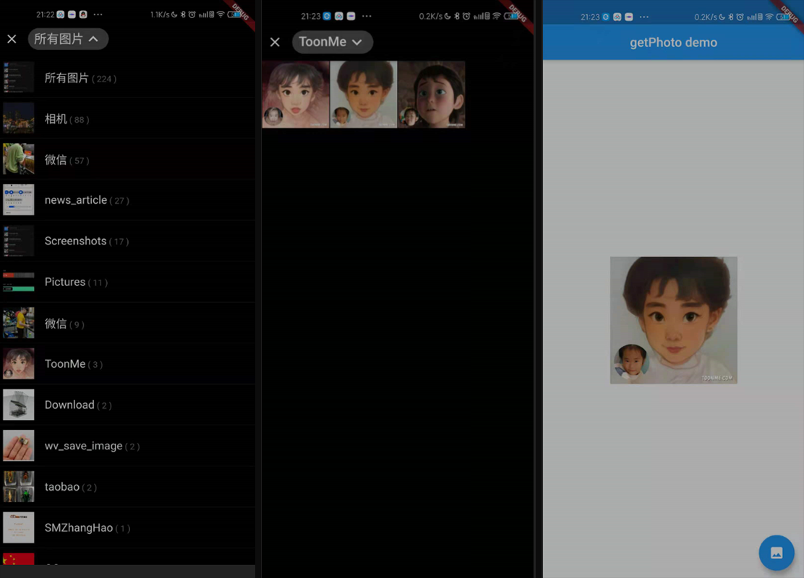

# get_photo

[](https://pub.dev/packages/get_photo)

A new photo selection plug-in UI, packaged with the photo_manager interface, supports IOS, Android, macOS; only supports selection of pictures.

一款新的照片选择插件UI，使用photo_manager 接口封装，支持IOS, Android, macOS；仅支持选择图片。

## Screenshots



## Example

```dart
Uint8List? _image;

GetPhoto(
  crossAxisCount: 4,
  lang: {
    'Recent': '所有图片',
    'Camera': '相机',
    'WeiXin': '微信',
  },
  onTap: (v) async {
    _image = await v.originBytes;
    //print((await v.titleAsync));
    //setState(() {});
  },
),
```

## Customization

Here is a list of properties available to customize your widget:

| Name | Type | Description |
|-----|-----|------|
|crossAxisCount| int | Display quantity in one line |
|onTap| ValueChanged<AssetEntity> | Choose to call back a parameter of type AssetEntity|
|lang| Map | Replace the default album name |
|showAlbumsList| bool | Show album list or all pictures by default |

| 名称 | 类型 | 描述 |
|-----|-----|------|
|crossAxisCount| int | 一行显示数量 |
|onTap| ValueChanged<AssetEntity> | 选择回调一个AssetEntity类型的参数|
|lang| Map | 替换默认相册名称 |
|showAlbumsList| bool | 默认显示相册列表还是全部图片 |

## FAQ

使用glide
在/android/build.gradle 增加

```
rootProject.allprojects {

    subprojects {
        project.configurations.all {
            resolutionStrategy.eachDependency { details ->
                if (details.requested.group == 'com.github.bumptech.glide'
                        && details.requested.name.contains('glide')) {
                    details.useVersion '4.11.0'
                }
            }
        }
    }
}
```

在/android/app/build.gradle 增加

```
+ apply plugin: 'kotlin-kapt'

dependencies {
    implementation "org.jetbrains.kotlin:kotlin-stdlib-jdk7:$kotlin_version"
   + implementation 'com.github.bumptech.glide:glide:4.11.0'
   + kapt 'com.github.bumptech.glide:compiler:4.11.0'
}

```

在/android/app/src/main/kotlin/com/xx/xx/

新建 AppGlideModule.kt 拷贝以下内容保存

```
package com.example.getphoto

import com.bumptech.glide.annotation.GlideModule
import com.bumptech.glide.module.AppGlideModule
@GlideModule
class MyAppGlideModule : AppGlideModule(){
}
```
